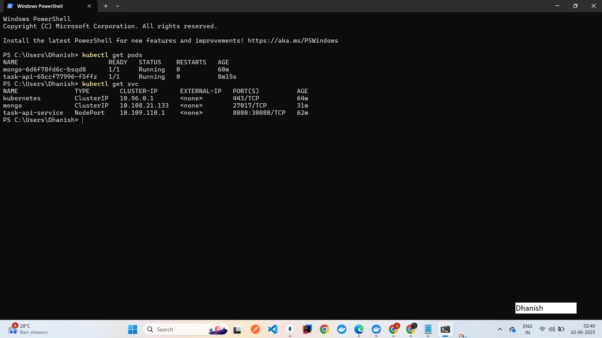

# Kaiburr Task 2 - Kubernetes Deployment

This repository contains my implementation of **Task 2** for Kaiburr’s assessment — deploying the Java Spring Boot backend and MongoDB in a Kubernetes environment.

---

## 📁 Project Overview

- **Backend**: Java Spring Boot application  
- **Database**: MongoDB  
- **Features**:  
  - Deploys MongoDB with PersistentVolume (PV) and PersistentVolumeClaim (PVC)  
  - Deploys the Java Spring Boot backend app  
  - Exposes the backend app via NodePort service  

---

## 🚀 Deployment Steps

1. Start **Minikube**:

    ```bash
    minikube start
    ```

2. Apply MongoDB PersistentVolume and PVC:

    ```bash
    kubectl apply -f k8s/mongo-pv.yaml
    ```

3. Deploy MongoDB:

    ```bash
    kubectl apply -f k8s/mongo-deployment.yaml
    ```

4. Deploy MongoDB Service:

    ```bash
    kubectl apply -f k8s/mongo-service.yaml
    ```

5. Deploy the Java backend app:

    ```bash
    kubectl apply -f k8s/app-deployment.yaml
    ```

6. Expose the backend app via NodePort service:

    ```bash
    kubectl apply -f k8s/app-service.yaml
    ```

7. Verify deployments:

    ```bash
    kubectl get pods
    kubectl get svc
    ```

8. (Optional) Port-forward to access the app locally:

    ```bash
    kubectl port-forward pod/<task-api-pod-name> 8080:8080
    ```

---

## 📦 Endpoints

✅ The backend API is exposed via:

    ```
    http://<minikube_ip>:30080/tasks
    ```

👉 Get Minikube IP:

    ```bash
    minikube ip
    ```

---

## 📸 Screenshots

✅ The following screenshots include the **date/time and my name** to verify authenticity.

### 🔎 GET Pods


### 🛠️ GET Services


### 🌐 API in Browser


---

## 📦 Deployment Notes

❌ Due to MongoDB connection issues in my environment, the backend app may not display tasks as expected.  
✅ However, all Kubernetes resources were deployed and verified.

---

✅ **Task 2 complete!**  
**Author**: Dhanish  
**Date**: 2025
